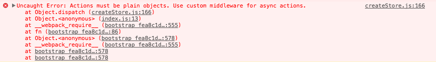

<!-- TO DO LIST:
3) Finish final product screen shot
5) Work through README once timed
6) Clean up/Follow up
7) Make sure the final CSS file gets moved into START
8) WHY ERROR.ERROR HOW DO YOU OBJECT ASSIGN NESTED OBJECTS
10) Why Redux Saga instead of Thunk? what'st he benefit?

CLEAN UP COMMENTS ON ALL BRANCHES
Grab a back up API in case NASA API keys are an issue
-->

<!-- SLIDES
  - Architecture of a Redux app
  - Role of Middleware
  - Finished product/What we are building
-->

<!-- FOLLOW UP:
  - talk about using `import { delay } from redux-saga`
-->


## Setup

We'll be starting from a boilerplate that already has the structure of a Redux app built out so we can dig straight into the meat of this workshop. I'll be using `npm` commands for my live-coding, but if `yarn` is your jam that's cool too.

Clone down this repository and **CHECK OUT THE BRANCH `start`**, run `npm install`, and `npm start` to see what we've got going on. Let's take a quick walk through of how our directory is set up.

While we get started, please also take a minute to visit the [Nasa Open API](https://api.nasa.gov/index.html#apply-for-an-api-key)  website and apply for an API key - this should be sent to your email address momentarily.  

*I suggest you paste this API key somewhere handy for the next couple hours for copy/paste convenience*

As mentioned during the intro to this workshop, the Redux workflow revolves around the Redux `store`. The entire goal of this baby app is to fetch a daily image from the Nasa website as soon as the application loads. To do this, we need our app to dispatch an action to make that API call which will then modify state and re render the components that care.  

Let's start by wiring up this first, immediate dispatch to fetch an image as soon as the app starts up.  

Update your primary `src/index.js` file with the following:    


```js
// src/index.js

import { getImage } from './actions'; // <-- NEW CODE

// ---- existing code --- //

store.dispatch(getImage()); // <-- NEW CODE

// --- additional existing code below --- //
```

This is already going to blow up because we haven't wired up any action creators yet, so `getImage()` is undefined.

```js
// actions/index.js  

export const getImage = () => (
    fetch('https://api.nasa.gov/planetary/apod?api_key=YOUR-API-KEY-HERE')
    .then(response =>  response.json())
    .then(json => console.log(json))
    .catch(error => console.log(error))
);
```

You'll notice when your app refreshes, we see this helpful error message:

;

There are two main rules about actions in a flux based framework:

1. Actions must be **plain objects**
2. Actions must have a **type**

Right now in our code we have what is called an 'asynchronous action'.

When we say "asynchronous action", we're referring to events that are triggered outside of the application's control. Your code is no longer explicitly in charge of WHEN to fire something or WHEN it gets information back. One or both of those events happen outside of the primary flow of the program.

Redux is designed to fire off **synchronous actions** - events that are controlled by the user. The moment an action is dispatched, redux is trying to immediately update state and pass that new information to any components that need it.  

Making an API call is an action that requires additional stages to complete, is primarily out of the user's control, and needs to be handled differently. Redux can't treat it like a simple action object because at the most basic level, it's NOT a simple object.  

From [the docs](http://redux.js.org/docs/advanced/AsyncActions.html#actions), there are three primary situations we need to address:  

1. When the request was initiated
  - We should tell our reducers that the request has started. This lets us implement a "spinner" or "loading" feature in case this takes a while.

2. When the request finished
  - We need to update our reducer when the request is complete, and this period of time is out of our control.
  - We can then stop the spinner and display the data received

3. If something goes wrong
  - Occasionally you will want to display error messages to the user, in which case our reducers need to be told how to handle any unsuccessful requests and what to tell the user.  

## Wiring Up Redux Part 1

Let's set this up with some basic action objects for now.  

```js
// actions/index.js  

// When the request is initiated, tell the app to show a spinner.
export const requestImage = () => ({
  type: 'REQUEST_IMAGE',
});

// When we receive the image, update state and shut off the spinner
export const setImage = (data) => ({
  type: 'SET_IMAGE',
  data,
});

// If something goes wrong, do something about it.  
export const catchError = (error) => ({
  type: 'ERROR',
  error,
});

// Update our initial action to do those things when the situation arises.
export const getImage = () => (
  dispatch => {
    dispatch(requestImage());
    return fetch('https://api.nasa.gov/planetary/apod?api_key=YOUR-API-KEY-HERE')
    .then(response => response.json())
    .then(json => dispatch(setImage(json)))
    .catch(error => dispatch(catchError(error)))
  };
);
```

You'll notice our error message is still there. We are still dealing with our original issue. Redux is trying to dispatch a rather complicated series of functions - which inherently are NOT plain, pure JS objects.  

Now's the time to add in a middleware library to step in and figure out what to do with this function we are dispatching. To kick things off and for comparison purposes, we'll start with a common library called `redux-thunk`.  

## Adding Middleware  

```bash
npm i -S redux-thunk
```

For reference, the term `thunk` in this context refers to a kind of "sidejob doer" - something that comes in to execute a subroutine outside of the normal flow of a process .  

The next step is to tell our redux store to include this middleware when it is created.  

```js
// src/index.js  

import thunk from 'redux-thunk';

// ---- additional dependencies ---- //

// Pop thunk into our applyMiddleware method
const store = createStore(
  rootReducer,
  composeWithDevTools(
    applyMiddleware(thunk)
  ),
);
```

No more error messages - now our Middleware library `redux-thunk` is intercepting every action that gets dispatched to the redux store. If it's not in a format that redux can handle, it takes care of any side jobs that need to happen to get it there.

*[If you're lost/got behind/didn't feel like coding along, you can check out the branch `1-wiring-up-redux-part-2` to start from here.]*

### Wiring Up Redux Part 2

Let's wire up the rest of redux to set this image to our application.

First, we need to make some adjustments to our `reducers/image.js` reducer. Currently we have a relatively empty boilerplate file that isn't doing a whole lot.  

Take a look back at `actions/index.js`.  

We need redux to update our store in a particular way every time each of those action creators is fired. Now is also a good time to step back and think about how we want to structure the **initial state** of our application.  

First, lets look at `requestImage()`.

```js
export const requestImage = () => ({
  type: 'REQUEST_IMAGE',
});
```

When redux intercepts a dispatched action with the type `REQUEST_IMAGE`, we want it to trigger a loader/spinner so our user knows everything is ok. Let's use a boolean to flag "loading" to true or false, we will start it at false.

```js
const initialState = {
  loading: false
}
```

The next action creator is `setImage()`

```js
export const setImage = (data) => ({
  type: 'SET_IMAGE',
  data,
});
```

For this, when our reducer intercepts `SET_IMAGE` I want to grab the data being passed through (let's assume it'll be an object) and save it in state. (We will also need to flip our `loading` boolean back to false when this modifies our state). We can add those data placeholders to our initial state object:

```js
const initialState = {
  loading: false,
  data: {
    explanation: '',
    hdurl: '',
    title: ''
  }
}
```

Lastly let's add a placeholder in case our reducer intercepts the action type `ERROR`.

```js
const initialState = {
  loading: false,
  data: {
    explanation: '',
    hdurl: '',
    title: '',
  }
  error: null,
}
```

Now let's adjust the switch statement in our reducer to update those placeholders when that action type is encountered.  

```js
// reducers/image.js

const initialState = {
  loading: false,
  data: {
    explanation: '',
    hdurl: '',
    title: '',
  },
  error: null,
}

const image = (state = initialState, action) => {
  switch (action.type) {
    case `REQUEST_IMAGE` :
      return Object.assign({}, state, { loading: true })
    case `SET_IMAGE` :
      return Object.assign({}, state, {
        loading: false,
        data: action.data
      })
    case `ERROR` :
      return Object.assign({}, state, { error: action.error })
    default :
      return state;
  }
}

export default image
```

Next, we need to set up a container that cares about this new piece of state...

```bash
mkdir src/containers && touch src/containers/image.js
```

```js
// containers/image.js

import { connect } from 'react-redux';

const mapStateToProps = ({ image }) => ({
  image,
});

export default connect(mapStateToProps, null);
```

...And flesh out our component so that it can receive information from the container we want access to

```js
// components/App/index.js

import React from 'react';
import Image from '../../containers/image';
import './styles.css';

const App = ({ image }) => {
  if ( image.error ) {
    return (
      <div>
        <h2>{image.error.error.code}</h2>
        <p>{image.error.error.message}</p>
      </div>
    )
  }

  return (
    <div className="App">
      <h1>{ image.data.title }</h1>
      <p>{ image.data.explanation }</p>
      
    </div>
  );
}

export default Image(App);
```

If you haven't already, take a moment to dig through the react and redux dev tools to see how we have access to all of this information.  

*[If you're lost/got behind/didn't feel like coding along, you can check out the branch `2-testing-redux-thunk` to start from here.]*

## Testing with Redux Thunk

We'll take a look at testing the breadth of this application later in the workshop, but for now I want to dig into how it feels to test async actions with redux thunk.  

First things first our test is going to run into some trouble when it hits this `fetch()` API call. Let's install a helper library to mock this out as well as a library to mock out our redux store.  

```bash
npm i -D fetch-mock redux-mock-store
```

We'll also need a testing directory.

```bash
mkdir src/__tests__ && touch src/__tests__/asyncActions.test.js
```

There's quite a bit to set up here. First, add the dependencies and set up some variables to mock out our application.

```js
// src/__tests__/asyncActions.test.js

import fetchMock from 'fetch-mock';
import configureMockStore from 'redux-mock-store';
import thunk from 'redux-thunk';

const middleware = [ thunk ];
const mockStore = configureMockStore(middleware);

import * as actions from '../actions';
```

Next, let's get a describe block ready and tell `fetchMock` to clean itself up after each test.  

```js
// src/__tests__/asyncActions.test.js

import fetchMock from 'fetch-mock';
import configureMockStore from 'redux-mock-store';
import thunk from 'redux-thunk';

const middleware = [ thunk ];
const mockStore = configureMockStore(middleware);

import * as actions from '../actions'

describe('getImage', () => {

  afterEach(() => {
    expect(fetchMock.calls().unmatched).toEqual([]);
    fetchMock.restore();
  });

});
```

Finally, we can flesh out our first `it` block.

```js
// src/__tests__/asyncActions.test.js

import fetchMock from 'fetch-mock';
import configureMockStore from 'redux-mock-store';
import thunk from 'redux-thunk';

const middleware = [ thunk ];
const mockStore = configureMockStore(middleware);

import * as actions from '../actions'

describe('getImage', () => {

  afterEach(() => {
    expect(fetchMock.calls().unmatched).toEqual([]);
    fetchMock.restore();
  });

  it('fires off requestImage when action is dispatched', () => {
    fetchMock.get('*', {
      status: 200,
    });

    const store = mockStore({
      image: {
        loading: false,
        data: {},
        error: null,
      }
    })

    const expectedActions = [
      { type: 'REQUEST_IMAGE' }
    ]

    store.dispatch(actions.getImage())

    expect(store.getActions()).toEqual(expectedActions)
    expect(fetchMock.called()).toEqual(true);
  });

});
```

Add another test to make sure our `setImage()` action fires with a successful response.

```js

it('fires off setImage with a valid response', () => {
  fetchMock.get('*', {
    status: 200,
    body: {
      url: '',
      stuff: ''
    }
  });

  const store = mockStore({
    image: {
      loading: false,
      data: {},
      error: null,
    }
  })

  const expectedActions = [
    { type: 'REQUEST_IMAGE' },
    { type: 'SET_IMAGE', data: {"stuff": "", "url": ""} },
  ]

  store.dispatch(actions.getImage()).then(() => {
   expect(store.getActions()).toEqual(expectedActions)
  })

  expect(fetchMock.called()).toEqual(true);
});
```

Finally let's cover our bases and write a test in case our fetch request fails.

```js
it('fires off catchError with an invalid response', () => {
  fetchMock.get('*', {
    status: 500
  });

  const store = mockStore({
    image: {
      loading: false,
      data: {},
      error: null,
    }
  })

  const expectedActions = [
    { type: 'REQUEST_IMAGE' },
    { error: new Error('Bad response from server'), type: 'ERROR' },
  ]

  store.dispatch(actions.getImage()).then(() => {
   expect(store.getActions()).toEqual(expectedActions)
  })

  expect(fetchMock.called()).toEqual(true);
});
```

*[If you're lost/got behind/didn't feel like coding along, you can check out the branch `3-sagas-start` to start from here.]*

## On To Sagas

So redux thunk is great, but what I want to focus on for the rest of this talk is a new(ish) library for handling this "what do I do with all of my side jobs" issue that React/Redux apps (among others) deal with on a daily basis.  

[Redux-Saga](https://github.com/redux-saga/redux-saga) allows you to organize all of the side effects that need to happen in your app in a single, completely separate thread. It can be accessed by both your main application and connect with the redux store/dispatch actions, etc.  

The cool part about this library is that it implements ES6 Generator functions to write super readable, testable, "OMG WHERE HAS THIS BEEN" lines of code.  

Let's look back at the action creator that `redux-thunk` steps in to handle :  

```js
export const getImage = () => (
  dispatch => {
    dispatch(requestImage());
    return fetch('https://api.nasa.gov/planetary/apod?api_key=YOUR-API-KEY-HERE')
    .then(response => response.json())
    .then(json => dispatch(setImage(json)))
    .catch(error => dispatch(catchError(error)))
  };
);
```  

In this function we are trying to accomplish a list of different things:  

1. Dispatch an action to tell redux that we have started our request (to trigger a loader/spinner)  
2. Send out the fetch request
3. Check to see if we receive a valid response
4. If yes: Dispatch an action to set the image
5. If no: Dispatch an action to do something with the error

That's a lot for one function. No part of that is single responsibility and it feels gross.  

Let's have a refactor party to swap out `redux-thunk` with `redux-saga` and play around with what this library offers.

## Saga Setup

First things first, grab the library.  

```bash
npm i -S redux-saga
```

Next, let's create a file where all of our "sagas" will be kept.  

```bash
touch src/sagas.js
```

In this file we will put all of the side-effects that we expect our application to fire off. One benefit to this off the bat is it keeps all of the messy stuff in one centralized location.  

Before we start implementing this new code, let's take a moment to break some stuff by refactoring our main `src/index.js` file to tell our store to grab the `redux-saga` library when it's first created, instead of `redux-thunk`.

```js
// src/index.js

import React from 'react';
import { render } from 'react-dom';
import { Provider } from 'react-redux';
import { createStore, applyMiddleware } from 'redux';
import { composeWithDevTools } from 'redux-devtools-extension';

// import thunk from 'redux-thunk';
import createSagaMiddleware from 'redux-saga';
import sagas from './sagas';

import App from './components/App';
import registerServiceWorker from './registerServiceWorker';
import rootReducer from './reducers';
import { getImage } from './actions';

import './styles.css';

const sagaMiddleware = createSagaMiddleware();

// Replace thunk with sagaMiddleware
const store = createStore(
  rootReducer,
  composeWithDevTools(
    applyMiddleware(sagaMiddleware)
  ),
);

sagaMiddleware.run(sagas);

store.dispatch(getImage());

/// Render method etc stays the same
```

If you take a look at your browser now, you'll see we get a (relatively) helpful error message:  

  

This makes sense. Sagas are simply a series of generator functions, each with a list of `yield expressions`. Each expression is in charge of running one piece of the side-effect puzzle. We currently have nothing in our `sagas.js` file so it's telling us it needs a job to do.  

Let's throw in a simple generator function to get started.  

```js
// src/sagas.js

export default function* testSaga() {
  console.log('Wired up!');
  yield 'WIRED UP!'
}

```

So we should see our `console.log()` statement, but we're also back to our middleware error message. This is because we fire off the line that says `sagaMiddleware.run(sagas);`, and then we immediately dispatch our async action, but we've removed the library (`redux-thunk`) that worked its secret magic to intercept this function before it hits redux.

Before we get further into Sagas and fix this error, let's sidetrack a little bit into what a Generator is.  

## ES6 Generators  

As previously mentioned, sagas are written using the new, hip, generator function that is baked into ES6. It looks like this:  

```js
function* doSomething() {
  yield 'You are a spiketail...'
  yield '...so we will call you Spike!'
}
```

There are a few things to note here. First, generator functions are indicated with an asterisk. (Note: The asterisk can be next to either the keyword `function*` or the function name `*doSomething` and the function will still be recognized as a generator.)   

Second, the content within the function starts with a `yield expression`. This is what tells the generator to pause.  

Once the generator function is called, it will only execute the code up until it encounters the keyword `yield`. This tells the generator function to return whatever is to the right of the yield, and then chill until told to continue.  

After executing the code to the right of the first yield, it won't just fire at will, it will wait to continue until you tell it to fire the next line, which is done using a `Generator Iterator`.  

**TRY IT OUT**

Grab that function mentioned above and throw it in a `repl` or your console.  

What happens if you run `doSomething()`?  

Hopefully, nothing happens. (If you're in the browser console you might see an output like `Generator status suspended`, but nothing actually gets executed). This is because this ISN'T a normal function and it can't be executed like a normal function.  

In order to properly execute this function we need to *iterate* over the *generator*, by constructing a *generator iterator*.  

Developers are the BEST at naming things.  

```js
function* doSomething() {
  yield 'You are a spiketail...'
  yield '...so we will call you Spike!'
}

// This is the generator iterator!
var gen = doSomething();
```

Then, to tell the generator iterator to DO something you need to run the method `.next()`.  

Before you run the next code snippet, **take a guess as to what you expect to see**.  

```js
function* doSomething() {
  yield 'You are a spiketail...'
  yield '...so we will call you Spike!'
}

var gen = doSomething();

gen.next();
```

The answer is super interesting! You might expect the return value to be the string 'You are a spiketail...' but instead the Generator returns a *Generator Object*.

You should see something print like:

```js
Object {value: 'You are a spiketail...', done: false}
```

Instead of simply the string of our first yield expression, we get an object with the *value* of our iteration (`You are a spiketail...`), and a *done* boolean indicating if our function has finished executing (`false`).  

And now it waits.  

Continue to run a couple more `gen.next()` functions and see what happens - when does our `done` boolean return `true`?  

Ok. Let's dig deeper. Copy/Paste the following lines of code into your console/repl:

```js
function *numbers() {
  yield 1
  yield 2
  yield 3
  yield 4
  yield 5
}

var gen = numbers();
```

As developers, our main goal in life is to do as little as possible to get the job done (but in a really hip, clean, maybe-a-little-bit-but-not-overly-unreadable way). Having to run `gen.next()` 5 times to execute 5 lines of code seems like a ridiculous thing to do.  

Luckily, as ES6 developers, we can leverage the [for of](https://developer.mozilla.org/en-US/docs/Web/JavaScript/Reference/Statements/for...of) loop to iterate over this interesting type of structure.  

```js
for(let num of gen){
	console.log(num)
}
```

Let's do something that will more accurately resemble the Saga(s) we are about to write:

```js
function *numbers() {
  yield 1
  yield 2
  yield* moreNums()
  yield 6
  yield 7
}

function *moreNums() {
  yield 3
  yield 4
  yield 5
}

var gen = numbers()

// Let's manually iterate over this to prove a point.
gen.next()
gen.next()
gen.next()
```

You'll notice after 3 executions the code hops into the `moreNums()` function, runs the line that returns `3` and then just HANGS OUT. It doesn't just FIRE EVERYTHING all at once.  

This is the epitome of why generators are so helpful when we are dealing with async code. Typically we have very little control over what happens in between when something sends out an API call and when it moves on with that returned information.  

As we saw in our redux-thunk example earlier, all we know is we fire the thing, then get the response back and it either works or blows up. What if we could step into that series of events and do more?  

## 2 Way Communication with Generators  

Another cool feature of generators is the ability to pass information back INTO a function in the middle of its execution.  

```js
function *adding(){
  var result = 1 + 1
  return 20 + (yield result)
}

var sum = adding()
```

In the example above, we start with a generator function called `*adding()` that assigns a variable to a mathematical addition operation, and then returns a value that includes a `yield expression`.  

**THINK ABOUT IT**  

What do you expect the value to be if you run `sum.next()`?  

What happens if you run `sum.next()` a second time?  

Take a second to think about this before you try it in your console.  

What happens is your generator runs every line of code until it encounters its first `yield expression`. It then fires off whatever is to the *right* of the keyword `yield`, (in this case, it looks for where the variable `result` was defined, which is `2`) and then waits.  

When you run it again, it has replaced `yield result` with whatever has been passed INTO the second `sum.next()` function, which (most likely) was nothing in your console logging attempt above.  

If you ran the code exactly as listed above, you should have seen something like:  

```js
Object {value: 2, done: false}
Object {value: NaN, done: true}
```

First Iteration: We get a value of `2`. Makes sense - if it stops at `yield` and fires whatever is to the right, we're asking for the `var` `result` which is `2`.  

Second Iteration: If it wipes out the yield expression and then replaces it with whatever argument we pass in, we are telling it to execute the line that says `20 + (the yield expression we just wiped out)` which, naturally, is `NaN`, if we pass in nothing.  

Try it again, but this time pass in a value the second time you call `sum.next()`.  

```js
function *adding(){
  var result = 1 + 1
  return 20 + (yield result)
}

var sum = adding()
sum.next()
sum.next(10)

// => Object {value: 30, done: true}
```

We've just accomplished real life, two way communication with a LIVE FUNCTION. You can dig deeper [here](https://developer.mozilla.org/en-US/docs/Web/JavaScript/Guide/Iterators_and_Generators), but lets circle back to our original topic.  

Now that these funky looking functions make more sense, let's go back to setting up our `sagas.js` file.  

### Implementing Sagas  

Recall that in our main `src/index.js` file we have the following line:  

```js
store.dispatch(getImage());
```

This line tells our redux store to dispatch an action which currently lives in our `actions/index.js` file. If we hop over to that file, recall that this function looks like this:  

```js
export const getImage = () => (
  dispatch => {
    dispatch(requestImage());
    return fetch('https://api.nasa.gov/planetary/apod?api_key=YOUR-API-KEY-HERE')
    .then(response => response.json())
    .then(json => dispatch(setImage(json)))
    .catch(error => dispatch(catchError(error)))
  };
);
```

We'll reference that code in a bit, so comment it out for reference and replace it with:  

```js
export const getImage = () => ({
  type: 'INITIALIZE_IMAGE_SAGA',
});
```

Now our `dispatch` method fires off a plain action object, instead of the multi-job async fetch call/function/craziness. FINALLY we can set up a Saga to step in and handle each intermediate step line by line.

We will start by leveraging something called a Saga Effect. These effects are part of the Redux Saga library and are standing guard, waiting to be put to use when a particular redux action is triggered.

First, we need to add a function that uses the Saga effect `takeEvery`. This effect is the most like redux-thunk. It's job is to hang out and listen for whatever action has been dispatched, intercepting that action if it matches the specified type.  

When it intercepts that action, it fires off the callback function passed in as its second argument.  

In our case, we tell the store to dispatch the action creator `getImage()`, which then dispatches an action with the type of `INITIALIZE_IMAGE_SAGA`. Let's update our saga to start paying attention.

```js
// sagas.js  

// Grab some saga effects
import { call, put, takeEvery, all } from 'redux-saga/effects';

// Remove the keyword 'default' here
export function* testSaga() {
  console.log('Wired up!');
  yield 'WIRED UP!'
}

// Similar to events in event listeners, we get the ACTION that was fired for free as an argument that is passed to our callback.
export function* getImageAsync(action) {
  console.log(action);
}

// This function will now watch for any time it intercepts a `GET_IMAGE` action type.
export function* watchGetImage() {
  yield takeEvery('INITIALIZE_IMAGE_SAGA', getImageAsync);
}

// Similar to having a root Reducer, we need one master Saga to export what we want to run when our store is created
export default function* rootSaga() {
  yield all([
    testSaga(),
    watchGetImage(),
  ]);
}
```

*[If you're lost/got behind/didn't feel like coding along, you can check out the branch `4-saga-effects` to start from here.]*

## Saga Effects

Redux Sagas provide us with a few different "effects" and helper methods that scoot things along. We just used `takeEvery`, which "takes" "every" action that matches a pattern it's been given and fires off the next saga when that pattern is matched. Additionally, as we indicated with our `console.log(action)` it appends the ACTION that was fired as the third argument to the function.

The next two we will implement are:  

* `put`
  - Example: `yield put(requestImage())`
  - Tells the middleware to dispatch an action to the redux store.
  - Returns an object of instructions

```js
{
  value: {
  PUT: {
    action: {
      type: 'REQUEST_IMAGE', channel: null
    }
  }
}
done: false
}
```

* `call`
  - Example: `yield call(fetchImage, ...args)`
  - Used when we need to get data asynchronously, and might need to do some stuff in between (like when you use `fetch` to make an API call)
  - Takes two arguments - a callback, and an optional spread of additional arguments   
  - Returns a plain object describing what instructions it is following out.

```js
{
  value: {
  CALL: {
    args: [
      0: 'first argument',
      1: 'second argument',
    ],
    context: null,
    fn: function fetchImage()
    }
  }
}
done: false
}
```

There are many more effects and helpers we can use, some of which are blocking (meaning they will wait for whatever they've been told to do to resolve), some are non-blocking (meaning they wait for no one). Check out [this section of the docs](https://github.com/redux-saga/redux-saga/tree/master/docs/api#takepattern) for all the goods.  

## Restructuring our API call

So now let's do something with the `getImageAsync` function we fired off. In this function, we want to fire off each of the action creators we originally had in our `actions/index.js` file that we were calling in that giant async function we commented out.  

To review, we want to:  
1. Tell redux we are requesting an image, so do the Loader thing.  
2. Fetch the image in the meantime  
3. Figure out what to do if stuff breaks  

```js
// sagas.js
import { call, put, takeEvery, all } from 'redux-saga/effects';
// Pull in our action creators
import { catchError, requestImage, setImage } from './actions'
// Grab our fetch function that we haven't made yet
import { fetchImage } from './fetch'

// ---- additional code ---- //

  export function* getImageAsync(action) {
    console.log(action)

    // Dispatch the 'REQUEST_IMAGE' action to the store to kick off our loader
    yield put(requestImage())

    // Make our async call to fetch
    const data = yield call(fetchImage);

    if (data && !data.error) {

      // Dispatch the 'SET_IMAGE' data to the store to do something with our API results
      yield put(setImage(data))

    } else {

      // Dispatch the 'ERROR' action to the store to tell the user something went wrong
      yield put(catchError(data))
    }
  }

  export function* watchGetImage() {
    yield takeEvery('INITIALIZE_IMAGE_SAGA', getImageAsync);
  }

  // ---- additional code ---- //
```

In the `getImageAsync()` we run a `call`, firing off the `fetchImage` function. This allows us to isolate any fetch requests. Let's say we have a big app - it might make sense to put all of our fetch requests in their own file.

```bash
touch src/fetch.js
```

```js
// fetch.js

const handleErrors = (response) => {
    if (!response.ok) {
      throw Error(response.statusText);
    }
    return response.json();
}

export const fetchImage = () => (
  fetch('https://api.nasa.gov/planetary/apod?api_key=EFZIxlP9Ry5aV1KIjYZilvSLqziN5RBOJicPD8W9')
  .then(response =>  response.json())
  .then(json => json)
  .catch(error => error)
);
```

Don't forget to import this file in `sagas.js`.  

Throw a few console logs at the end of this file to watch how the saga progresses:

```js
const gen = getImageAsync();
console.log(gen.next());
console.log(gen.next());
console.log(gen.next());
console.log(gen.next());
```

*[If you're lost/got behind/didn't feel like coding along, you can check out the branch **`5-testing-sagas`** to start from here.]*

#### Testing Sagas & Redux

First of all, if you run the existing tests now you'll get some errors. This is because the first action we fire is no longer `REQUEST_IMAGE`, and that action creator doesn't immediately fire off our fetch call.  

This also means that now we can isolate what we're testing in a more specific way because our `actions/index.js` file now ONLY contains plain old action creators and return plain old action objects, which are ridiculously easy to test.

Hop into the `__tests__/asyncActions.js` file and skip that first `describe()` block, for now, and create a couple quick files to demonstrate the ease of testing clean redux action creators/reducers:  

```bash
touch src/__tests__/actions.test.js src/__tests__/reducers.test.js src/__tests__/sagas.test.js
```

```js
// __tests__/actions.test.js  

import * as actions from '../actions';

describe('actionCreators', () => {
  it('getImage should return INITIALIZE IMAGE SAGA type', () => {
    const expected = { type: 'INITIALIZE_IMAGE_SAGA' };
    expect(actions.getImage()).toEqual(expected);
  });

  it('catchError should return ERROR type with an error', () => {
    const expected = { type: 'ERROR', error: 'hello' };
    expect(actions.catchError('hello')).toEqual(expected);
  });
});

// etc etc etc
```

Testing redux reducers is also painfully straightforward. Check it out:  

```js
// __tests__/reducers.test.js  

import reducer from '../reducers/image.js';
import * as actions from '../actions';

const initialState = {
  loading: false,
  error: null,
  data: {
    explanation: '',
    hdurl: '',
    title: ''
  },
};

describe('image reducer', () => {
  it('should return the initial state', () => {
    expect(reducer(undefined, {})).toEqual(initialState);
  });

  it('type ERROR', () => {
    const error = 'Something went wrong';
    const action = actions.catchError(error);
    const expected = {
      loading: false,
      error: error,
      data: {explanation: '', hdurl: '', title: ''},
    };

    expect(reducer(undefined, action)).toEqual(expected);
  });

});

```

Lucky for us, testing sagas isn't much more complicated.  

To set up this testing file, we need to grab all of the things associated with our sagas. The beauty of using Sagas is that we are now dealing with ES6 Generator functions. We can now run each line of code and test each specific `yield expression` to ensure that we are getting back that plain old JS object with the value we expect.  

Let's start with our first example `*testSaga()` generator function to see what this looks like.

```js
// __tests__/sagas.test.js

import { takeEvery } from 'redux-saga';
import { call, put, take } from 'redux-saga/effects';

import { requestImage, setImage, handleError } from '../actions';
import { fetchImage } from '../fetch';

import { testSaga, getImageAsync, watchGetImage } from '../sagas';

describe('test saga', () => {
  const generator = testSaga();

  it('calls the test saga function', () => {
    const testValue = generator.next().value;

    expect(testValue).toEqual('WIRED UP!');
  });
});
```

That one doesn't have a whole lot going on though so let's add another describe block for the `getImageAsync()` generator to see if it gets more complicated.


```js
describe('getImageAsync', () => {
  it('handles a successful function', () => {
    const generator = getImageAsync();

    const data = { hdurl: 'some url', explanation: 'stuff and things', title: 'words', }

    expect(generator.next().value).toEqual(put(requestImage()), 'makes a dispatch to request image ');
    expect(generator.next().value).toEqual(call(fetchImage), 'makes a call to fetch the image');
    expect(generator.next().value).toEqual(put(setImage(data)), 'dispatches set image')
  });
});
```

You'll notice our test fails. This is because `setImage(data)` needs data! It gets that data from the result of the previous `yield expression`. Think back to that concept of 2 way communication within generators - right now because we are in a fake testing environment, we have to manually run each `generator.next().value` line, the saga library isn't doing that for us.

We can TELL OUR GENERATOR 'hey - let's pretend this is what you got back after that last yield expression. Carry on and make sure the rest of the instructions make sense.'. We're essentially stubbing in whatever we want to get back from our API call, and letting our generator move along.  

```js
 // Pass data into our generator iterator when we need it to be accessible
  expect(generator.next(data).value).toEqual(put(setImage(data)), 'dispatches set image')
```

Finally, let's add a sad path to make sure that if our try/catch block fails that we trigger the error handling.  

```js

it('handles an unsuccessful function', () => {
  const generator = getImageAsync();

  const error = {
    error: 'BROKE STUFF'
  }

  expect(generator.next().value).toEqual(put(requestImage()), 'makes a dispatch to request image ');
  expect(generator.next().value).toEqual(call(fetchImage), 'makes a call to fetch the image');
  expect(generator.next(error).value).toEqual(put(catchError(error)), 'catches the error')
});
```


### Resources

* [Redux Docs](http://redux.js.org/docs)  
* [Redux Saga Docs](https://github.com/redux-saga/redux-saga)
